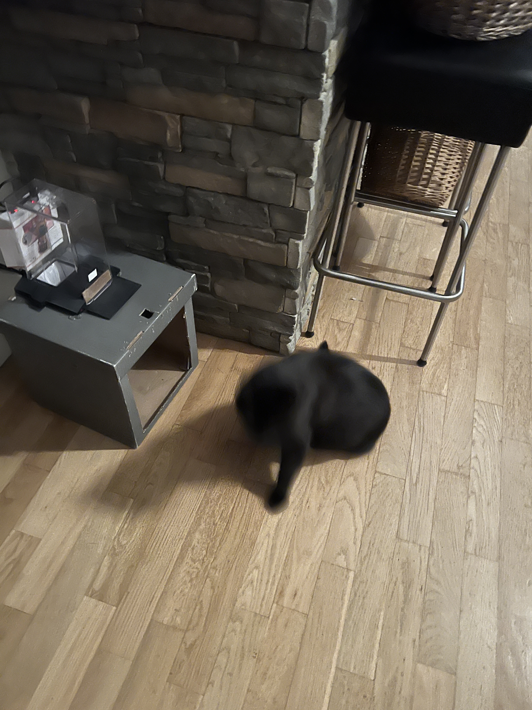
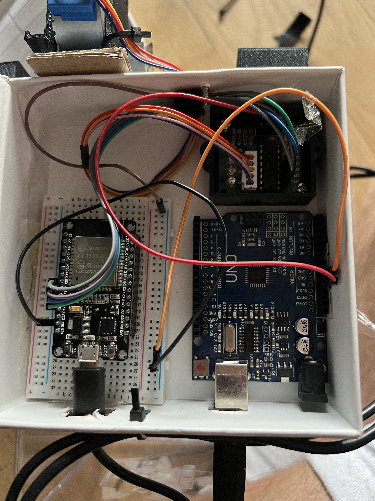

# ESP-Cat - Automatyczny karmnik i oswietlenie

Repozytorium zawiera konfiguracje ESPHome dla dwoch urzadzen ESP32 dzialajacych w sieci domowej.

---

## ESP-Cat — karmnik dla kota

Silnik krokowy (ULN2003) obraca podajnik dozujacy karme. Urzadzenie dziala samodzielnie po wlaczeniu zasilania.

Panel sterowania: **http://192.168.1.165**

### Zdjecia

| Urzadzenie                               | Elektronika                     |
| ---------------------------------------- | ------------------------------- |
|  |  |

### Dostepne akcje

| Akcja                       | Opis                                     |
| --------------------------- | ---------------------------------------- |
| **Move Forward / Backward** | Podanie karmy — glowna metoda sterowania |
| **Rotation**                | Ciagle obroty wl/wyl                     |
| **STOP**                    | Zatrzymanie silnika                      |
| **Cat dispenser**           | ~~10 cykli przod/tyl~~ — deprecated      |

### Komponenty

| Komponent                | Opis                   |
| ------------------------ | ---------------------- |
| ESP32 (dev board)        | Mikrokontroler z WiFi  |
| ULN2003 + silnik krokowy | GPIO 25 / 26 / 27 / 14 |

---

## ESP-LED — oswietlenie i czujniki

Trzy niezalezne kanaly swiatla LED (USB 1/2/3) sterowane PWM, czujnik temperatury DS18B20, czujnik temperatury/wilgotnosci Xiaomi LYWSD03MMC przez BLE oraz przekaznik (Gate Remote).

### Dostepne akcje

| Akcja                         | Opis                                                                |
| ----------------------------- | ------------------------------------------------------------------- |
| **USB 1 / USB 2 / USB 3**     | Wlaczanie/regulacja jasnosci, efekty: Pulse, Fast Pulse, Slow Pulse |
| **Gate Remote**               | Impuls 1s na przekazniku (GPIO 2)                                   |
| **Salon Temp**                | Odczyt temperatury z czujnika DS18B20 (GPIO 23)                     |
| **MI Temperature / Humidity** | Dane z Xiaomi LYWSD03MMC przez BLE                                  |
| **WiFi Signal**               | Sila sygnalu WiFi                                                   |

### Komponenty

| Komponent         | Opis                                 |
| ----------------- | ------------------------------------ |
| ESP32 (dev board) | Mikrokontroler z WiFi + BLE          |
| LEDC PWM          | GPIO 17, 19, 18 — 3x kanal LED       |
| DS18B20           | Czujnik temperatury 1-Wire (GPIO 23) |
| Xiaomi LYWSD03MMC | Termometr BLE (`A4:C1:38:45:63:83`)  |
| Przekaznik        | GPIO 2 — Gate Remote                 |

---

## Zmiana konfiguracji (OTA przez WiFi)

> Urzadzenie musi byc wlaczone i podlaczone do WiFi.

### 1. Przygotuj secrets

Skopiuj szablon i wpisz dane otrzymane od wlasciciela projektu:

```bash
cp config/secrets.yaml.example config/secrets.yaml
# uzupelnij config/secrets.yaml otrzymanymi wartosciami
# Sprawdź NAS public :)
```

> `secrets.yaml` jest w `.gitignore` i nigdy nie trafi do repo.

### 2. Uruchom ESPHome Dashboard

```bash
docker compose up -d
```

Otworz **http://localhost:6052** w przegladarce.

### 3. Wprowadz zmiany i wgraj

Edytuj odpowiedni plik konfiguracyjny, nastepnie uruchom:

```bash
# ESP-Cat (karmnik)
docker exec -it esphome esphome run /config/espcat.yaml

# ESP-LED (oswietlenie)
docker exec -it esphome esphome run /config/esp-led.yaml
```

Kompilacja i wgranie OTA trwa ok. 1-2 minuty, logi widac na zywo w terminalu. Po zakonczeniu mozna zatrzymac Dashboard — urzadzenia dzialaja samodzielnie:

```bash
docker compose down
```

---

## Pierwsze wgranie od zera (tylko jesli ESP32 jest "goly")

Jesli ESP32 nie ma jeszcze wgranego firmware, uzyj **https://web.esphome.io/** w Chrome/Edge — zaladuj odpowiedni yaml + `secrets.yaml` i wgraj przez USB.

---

## Debugowanie

- Sprawdz czy wszystkie kabelki sa dokladnie wpiete

## Wskazowki montazowe

- Przewlec trytytke przez przednia dziure na gorze pudelka i przymocowac gorne wieko do dolnej czesci — bez tego kot moze przewrocic gorna czesc urzadzenia
- Dodac cos ciezkiego na dno pudelka zeby zwiekszyc stabilnosc
- Uwazac na prowadnice — jest dluga i delikatna, Salem lubi sie o nia ocierac i bawic, co moze ja uszkodzic lub rozkalibrować
- Do obserwowania kota uzywac aplikacji **AlfredCam**

---

## TODO

- [ ] Zrobic zasilanie 5V dla silnika bezposrednio z ESP32 — aktualnie Arduino sluzy tylko jako zasilacz 5V dla ULN2003, co jest zbednym elementem w ukladzie
- [ ] Poprawic mocowanie silnika i prowadnicy — zamienic elementy papierowe na wydrukowane 3D, aktualnie montaz jest niedokladny

---

## Struktura repo

```
esp-cat/
├── config/
│   ├── espcat.yaml          # ESP-Cat — karmnik
│   ├── esp-led.yaml         # ESP-LED — oswietlenie i czujniki
│   └── secrets.yaml.example # szablon — uzupelnij danymi od wlasciciela
├── photos/
├── docker-compose.yml
├── .gitignore               # secrets.yaml jest wykluczone z repo
└── README.md
```
